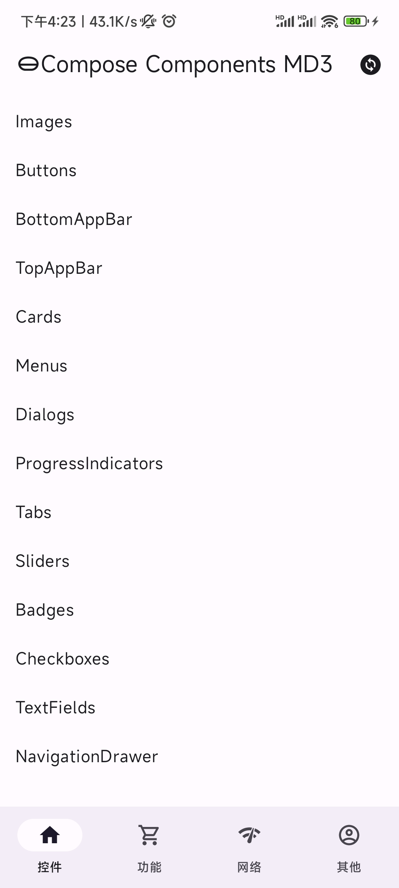
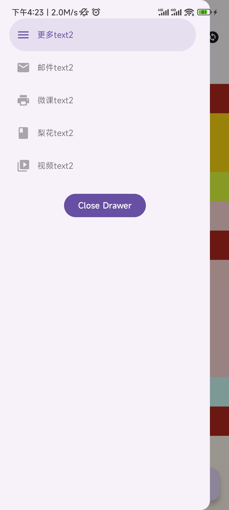
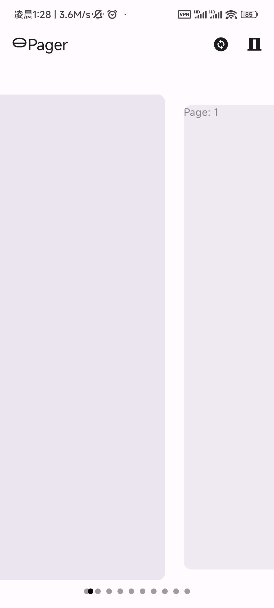

#JetPack Compose 使用案例

**这个是一个练习项目，练习JetPack-Compose**

## [Demo下载](http://d.maps9.com/vpf4)

## 预览

|  MD3 |     |  |
| ------- | -------- | ---- |
|  |  |      |
|  |  ||
|  |  | |

## JetPack Compose 相关文档
- [Jetpack Compose 修饰符列表](https://developer.android.com/jetpack/compose/modifiers-list?hl=zh-cn#Actions)
- [Jetpack Compose 基础知识](https://developer.android.com/courses/pathways/compose?hl=zh-cn)

## JetPack Compose 相关的第三方库

### Accompanist
- [https://google.github.io/accompanist/](https://google.github.io/accompanist/)

### material3相关
- [Material Design 3](https://m3.material.io/)
- [androidx.compose.material3 文档](https://developer.android.com/reference/kotlin/androidx/compose/material3/package-summary)

### 图片加载 coil
- [coil](https://coil-kt.github.io/coil/compose/)

## TODO
- [ ] Func
- [ ] Mine